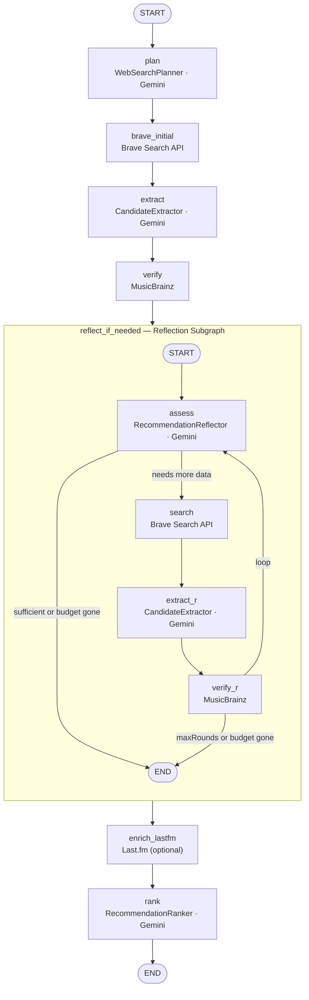

# Bandsearch

[](https://github.com/eikrad/bandsearch-app/actions/workflows/ci.yml)


AI-powered music recommendations for niche and lesser-known artists. Describe bands you love, and Bandsearch surfaces similar but lesser-known picks — verified against MusicBrainz and ranked by Gemini.

## Features

- **Niche artist discovery** — Gemini plans targeted Brave searches (FFO/Bandcamp-style) to find obscure artists that match your taste
- **MusicBrainz verified** — every suggestion is checked against real artist records (mbid, genres, tags, URL relations)
- **Preference memory** — save and rate bands; future recommendations adapt to your listening history
- **Reflection loop** — if the first search pass is thin, the AI generates refined queries and searches again (up to 2 extra rounds)
- **Native desktop app** — Tauri shell for Linux, macOS, and Windows; API keys stored in the OS config directory
- **Flexible storage** — SQLite by default, PostgreSQL or Turso for shared/cloud deployments
- **Optional multi-user auth** — activates automatically once you register the first account; single-user setups need no config

## How it works



See [`docs/architecture/ARCHITECTURE.md`](docs/architecture/ARCHITECTURE.md) for a full description of all nodes, state fields, and design decisions.

---

## Documentation

| Path | What it covers |
|------|----------------|
| [docs/architecture/ARCHITECTURE.md](docs/architecture/ARCHITECTURE.md) | Full pipeline — nodes, reflection subgraph, state fields, storage, auth, and eval layer |
| [docs/ROADMAP.md](docs/ROADMAP.md) | Phase-by-phase roadmap with completion status |
| [docs/adr/0001-prompt-injection-guardrails.md](docs/adr/0001-prompt-injection-guardrails.md) | ADR: prompt injection defence strategy |
| [docs/design/UI_GUIDELINES.md](docs/design/UI_GUIDELINES.md) | UI layout and component guidelines |
| [docs/maintenance.md](docs/maintenance.md) | Dependency upgrade notes |

---

## Tech Stack

| Layer | Technology |
|-------|------------|
| API server | Express.js + TypeScript (Node.js 22+) |
| AI pipeline | LangGraph + Google Gemini |
| Web search | Brave Search API |
| Artist verification | MusicBrainz |
| Desktop shell | Tauri v2 (Rust) + React + TypeScript |
| Database | SQLite / PostgreSQL / Turso (pluggable) |
| Auth | bcrypt + JWT (30-day sessions) |

---

## Quick Start

**Prerequisites:** Node.js 22+

```bash
git clone https://github.com/eikrad/bandsearch-app
cd bandsearch-app
npm install
cp .env.example .env        # then add GEMINI_API_KEY and BRAVE_API_KEY
npm run dev                 # API starts on http://localhost:3001
```

Preferences are saved automatically to `bandsearch.db` — no database setup needed.
Both `GEMINI_API_KEY` and `BRAVE_API_KEY` are required to start the API.

Test it:

```bash
curl -X POST http://localhost:3001/recommendations \
  -H "content-type: application/json" \
  -d '{"query": "I like Alcest and Agalloch"}'
```

---

## Desktop App (Tauri)

**Additional prerequisites:** [Rust](https://rustup.rs) + platform build tools (see below)

```bash
npm run desktop             # opens native window, starts API automatically
```

### Platform prerequisites

**Linux:**
```bash
# Arch / Manjaro
sudo pacman -S webkit2gtk-4.1 libappindicator-gtk3 librsvg

# Debian / Ubuntu
sudo apt install libwebkit2gtk-4.1-dev libappindicator3-dev librsvg2-dev patchelf
```

**macOS:** Xcode Command Line Tools (`xcode-select --install`). No additional packages needed.

**Windows:** [Visual Studio Build Tools](https://visualstudio.microsoft.com/visual-cpp-build-tools/) with the **Desktop development with C++** workload. WebView2 is built into Windows 10 1803+ and Windows 11.

### API key storage

Keys are written to the OS config directory as `bandsearch/config.json`. Use **Settings** in the app header to save your Gemini and Brave keys.

| OS | Path |
|----|------|
| Linux | `~/.config/bandsearch/config.json` |
| macOS | `~/Library/Application Support/bandsearch/config.json` |
| Windows | `%APPDATA%\bandsearch\config.json` |

If a recommendation call fails, the chat view shows a banner with a short, human-readable hint.

---

## Authentication

Optional local multi-user auth (bcrypt + 30-day JWT). Auth behaviour is determined by how many users are registered:

| Users registered | Behaviour |
|-----------------|----------|
| 0 | Pass-through — all requests accepted, no token needed |
| 1 | Auto-attach — requests are automatically associated with the single user |
| ≥ 2 | Enforced — `Authorization: Bearer <token>` required for preference endpoints |

Register with `POST /auth/register`, which returns a JWT token and a **recovery code**. Store the recovery code safely — it is the only way to reset your password. Tokens expire after 30 days.

Set `JWT_SECRET` in your environment for persistent sessions across restarts.

---

## Storage

Bandsearch uses two persistence domains:

- **Preferences store** (`saved_bands`, groups) — configurable via `PREFERENCE_STORE`.
- **Session store** (`chat_sessions`, `chat_messages`) — local SQLite in `DATABASE_PATH` (default `bandsearch.db`).

| `PREFERENCE_STORE` | Description |
|--------------------|-------------|
| `sqlite` (default) | Local file, zero-config, data survives restarts |
| `memory` | In-process only, data lost on restart |
| `postgres` | PostgreSQL / Supabase; run `npm run migrate` after setup |
| `turso` | Turso cloud SQLite — enables cross-device sync |

See `.env.example` for the connection variables needed for each backend (`DATABASE_URL`, `TURSO_DATABASE_URL`, `TURSO_AUTH_TOKEN`).

---

## Configuration

Required variables:

| Variable | Description |
|----------|-------------|
| `GEMINI_API_KEY` | Google Gemini — required, API will not start without it |
| `BRAVE_API_KEY` | Brave Search token for niche artist discovery |

Common optional variables:

| Variable | Default | Description |
|----------|---------|-------------|
| `PORT` | `3001` | API port |
| `JWT_SECRET` | *(auto-generated)* | Set for persistent sessions across restarts |
| `PREFERENCE_STORE` | `sqlite` | `sqlite`, `memory`, `postgres`, or `turso` |
| `LASTFM_API_KEY` | — | Last.fm fallback for artist images and obscurity scoring |
| `MISTRAL_API_KEY` | — | Activates the async LLM-as-judge eval scoring — despite the name, it's sent to Anthropic's API (Claude judge model), not Mistral |
| `LANGSMITH_API_KEY` | — | LangSmith distributed tracing |

See `.env.example` for all options including storage backends, timeouts, search budgets, and CORS settings.

---

## Deployment

The API is a standalone Express service and can run anywhere Node.js 22+ is available. `render.yaml` at the repo root configures a [Render](https://render.com) Web Service (`bandsearch-api`, Node environment, Frankfurt region, `npm start`) as the supported hosted option.

Recommended production setup is `PREFERENCE_STORE=turso`, so the API stays stateless and all data (preferences, sessions, auth) lives in Turso/libSQL:

1. Create a Turso database, then run the migration once against it:
   ```bash
   TURSO_DATABASE_URL=... TURSO_AUTH_TOKEN=... npm run migrate:turso --workspace @bandsearch/api
   ```
2. Configure the secrets Render does not store in `render.yaml` — via the Render dashboard: `GEMINI_API_KEY`, `BRAVE_API_KEY`, `TURSO_DATABASE_URL`, `TURSO_AUTH_TOKEN`, `JWT_SECRET`.
3. In the desktop app's Settings screen, point the API endpoint at the deployed URL instead of the local sidecar (leave it unset to keep using localhost).

Render's free tier spins down after 15 minutes of inactivity, so the first request after a cold start can take 30-60 seconds.

---

## Desktop releases

Tagged pushes matching `v*` run [`.github/workflows/release.yml`](.github/workflows/release.yml): each OS downloads the matching Node sidecar into `apps/desktop/src-tauri/binaries/`, then `tauri-apps/tauri-action` builds installers and opens a **draft prerelease**.

One-time signing setup (required before the first tag):

1. Generate keys (private key stays outside the repo):
   ```bash
   npx --workspace @bandsearch/desktop tauri signer generate -w ~/.tauri/bandsearch.key
   ```
2. Put the **public** key string into `apps/desktop/src-tauri/tauri.conf.json` → `plugins.updater.pubkey` (already set for the current keypair).
3. Add GitHub Actions secrets:
   - `TAURI_SIGNING_PRIVATE_KEY` — contents of `~/.tauri/bandsearch.key`
   - `TAURI_SIGNING_PRIVATE_KEY_PASSWORD` — password used at generation (empty string if none)

In-app update UI is still Phase 10; this pipeline already produces signed updater artifacts (`createUpdaterArtifacts`) and `latest.json` for that work.

---

## Development

```bash
npm test          # run all workspace tests
npm run ci        # lint + typecheck + test
npm run test:e2e  # Playwright end-to-end smoke tests (spins up the API and a static frontend)
```

Tests run automatically before every commit via a pre-commit hook (installed by `npm install`). CI runs on both `ubuntu-latest` and `windows-latest` via a GitHub Actions matrix.

---

## Monorepo Structure

```
apps/desktop/     — Tauri + React desktop client
services/api/     — Express API
services/eval/    — golden dataset and eval runner (anti-band gate, nugget coverage)
shared/schemas/   — shared TypeScript validation contracts
docs/             — architecture docs, ADRs, design specs, roadmap
```

---

## Contributing

Contributions are welcome. See [CONTRIBUTING.md](CONTRIBUTING.md) for the expected workflow, required checks, and commit style, and [CODE_OF_CONDUCT.md](CODE_OF_CONDUCT.md) for community guidelines. Please report security issues as described in [SECURITY.md](SECURITY.md) rather than filing a public issue.

---

## Acknowledgements

- [MusicBrainz](https://musicbrainz.org) — open music encyclopedia providing artist and release metadata (CC0 1.0)
- [Google Gemini](https://deepmind.google/technologies/gemini/) — LLM powering the recommendation and explanation layer
- [LangChain](https://www.langchain.com) — framework for structuring Gemini model calls
- [Tauri](https://tauri.app) — framework for the native desktop wrapper
- [Brave Search](https://brave.com/search/api/) — web search API for niche artist discovery

---

## License

Apache 2.0 — see [LICENSE](LICENSE).
