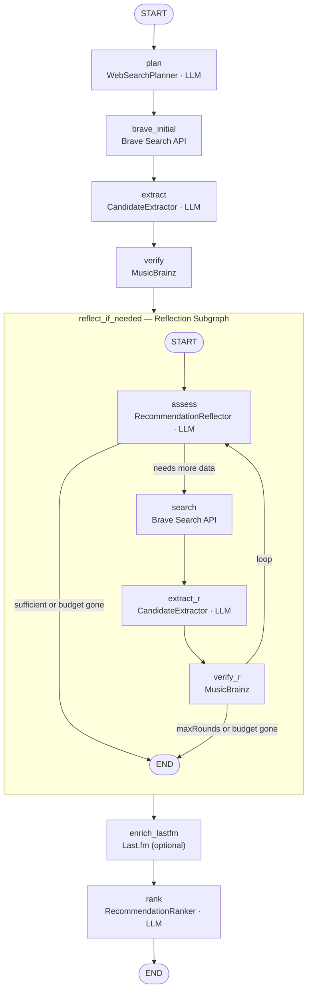

# Bandsearch

[](https://github.com/eikrad/bandsearch-app/actions/workflows/ci.yml)


AI-powered music recommendations for niche and lesser-known artists. Describe bands you love, and Bandsearch surfaces similar but lesser-known picks — verified against MusicBrainz and ranked by Gemini.

## Features

- **Niche artist discovery** — an LLM plans targeted Brave searches (FFO/Bandcamp-style) to find obscure artists that match your taste
- **MusicBrainz verified** — every suggestion is checked against real artist records (mbid, genres, tags, URL relations)
- **Preference memory** — save and rate bands; future recommendations adapt to your listening history
- **Reflection loop** — if the first search pass is thin, the AI generates refined queries and searches again (up to 2 extra rounds)
- **Native desktop app** — Tauri shell for Linux, macOS, and Windows; API keys stored in the OS config directory
- **Flexible storage** — SQLite by default, Turso for shared/cloud deployments
- **Optional multi-user auth** — activates automatically once you register the first account; single-user setups need no config. A hosted deployment can run closed (`AUTH_MODE=enforced`, email-bound invite codes)

## How it works


```mermaid
flowchart TD
    START(["START"]) --> plan["plan\nWebSearchPlanner · LLM"]
    plan --> brave_initial["brave_initial\nBrave Search API"]
    brave_initial --> extract["extract\nCandidateExtractor · LLM"]
    extract --> verify["verify\nMusicBrainz"]
    verify --> reflect_if_needed

    subgraph reflect_if_needed["reflect_if_needed — Reflection Subgraph"]
        direction TD
        subSTART(["START"]) --> assess["assess\nRecommendationReflector · LLM"]
        assess -- "sufficient or budget gone" --> subEND(["END"])
        assess -- "needs more data" --> search["search\nBrave Search API"]
        search --> extract_r["extract_r\nCandidateExtractor · LLM"]
        extract_r --> verify_r["verify_r\nMusicBrainz"]
        verify_r -- "maxRounds or budget gone" --> subEND
        verify_r -- "loop" --> assess
    end

    reflect_if_needed --> enrich_lastfm["enrich_lastfm\nLast.fm (optional)"]
    enrich_lastfm --> rank["rank\nRecommendationRanker · LLM"]
    rank --> END(["END"])
```

See [`docs/architecture/ARCHITECTURE.md`](docs/architecture/ARCHITECTURE.md) for a full description of all nodes, state fields, and design decisions.

---

## Documentation

| Path | What it covers |
|------|----------------|
| [docs/architecture/ARCHITECTURE.md](docs/architecture/ARCHITECTURE.md) | Full pipeline — nodes, reflection subgraph, state fields, storage, auth, and eval layer |
| [docs/ROADMAP.md](docs/ROADMAP.md) | Phase-by-phase roadmap with completion status |
| [docs/adr/0001-prompt-injection-guardrails.md](docs/adr/0001-prompt-injection-guardrails.md) | ADR: prompt injection defence strategy |
| [docs/adr/0002-machine-written-notes-stay-out-of-the-prompt.md](docs/adr/0002-machine-written-notes-stay-out-of-the-prompt.md) | ADR: only a user-edited note reaches the recommendation prompt |
| [docs/design/UI_GUIDELINES.md](docs/design/UI_GUIDELINES.md) | UI layout and component guidelines |
| [docs/maintenance.md](docs/maintenance.md) | Dependency upgrade notes |

---

## Tech Stack

| Layer | Technology |
|-------|------------|
| API server | Express.js + TypeScript (Node.js 26+) |
| AI pipeline | LangGraph + Scaleway Generative APIs (DeepSeek V4 Flash by default; Gemini selectable) |
| Web search | Brave Search API |
| Artist verification | MusicBrainz |
| Desktop shell | Tauri v2 (Rust) + React + TypeScript |
| Database | SQLite / Turso (pluggable) |
| Auth | bcrypt + JWT (30-day sessions) |

---

## Quick Start

**Prerequisites:** Node.js 26+

```bash
git clone https://github.com/eikrad/bandsearch-app
cd bandsearch-app
npm install
cp .env.example .env        # then add SCW_SECRET_KEY and BRAVE_API_KEY
npm run dev                 # API starts on http://localhost:3001
```

Preferences are saved automatically to `bandsearch.db` — no database setup needed.
Both `SCW_SECRET_KEY` (Scaleway) and `BRAVE_API_KEY` are required to start the API (with `LLM_PROVIDER=gemini`, `GEMINI_API_KEY` instead of the Scaleway key).

Test it:

```bash
curl -X POST http://localhost:3001/recommendations \
  -H "content-type: application/json" \
  -d '{"query": "I like Alcest and Agalloch"}'
```

---

## Desktop App (Tauri)

**Additional prerequisites:** [Rust](https://rustup.rs) + platform build tools (see below)

```bash
npm run desktop             # opens native window, starts API automatically
```

Tauri expects a Node sidecar next to the Rust crate (`bundle.externalBin`). For local
dev, symlink your system Node once (the file is gitignored):

```bash
# Linux / macOS — use the host triple from: rustc -vV | grep ^host
ln -sf "$(which node)" apps/desktop/src-tauri/binaries/node-$(rustc -vV | sed -n 's/^host: //p')
```

On Windows, copy `node.exe` to
`apps/desktop/src-tauri/binaries/node-x86_64-pc-windows-msvc.exe` instead.

### Platform prerequisites

**Linux:**
```bash
# Arch / Manjaro
sudo pacman -S webkit2gtk-4.1 libappindicator-gtk3 librsvg

# Debian / Ubuntu
sudo apt install libwebkit2gtk-4.1-dev libappindicator3-dev librsvg2-dev patchelf
```

**macOS:** Xcode Command Line Tools (`xcode-select --install`). No additional packages needed.

**Windows:** [Visual Studio Build Tools](https://visualstudio.microsoft.com/visual-cpp-build-tools/) with the **Desktop development with C++** workload. WebView2 is built into Windows 10 1803+ and Windows 11.

### API key storage

Keys are written to the OS config directory as `bandsearch/config.json`. Use **Settings** in the app header to save your Scaleway and Brave keys. A Gemini key stored by an earlier version is removed, since it cannot run the default provider.

| OS | Path |
|----|------|
| Linux | `~/.config/bandsearch/config.json` |
| macOS | `~/Library/Application Support/bandsearch/config.json` |
| Windows | `%APPDATA%\bandsearch\config.json` |

If a recommendation call fails, the chat view shows a banner with a short, human-readable hint.

---

## Authentication

Local multi-user auth (bcrypt + 30-day JWT) with two modes, chosen by `AUTH_MODE`.

### `progressive` (default)

For a personal install. Behaviour depends on how many users are registered:

| Users registered | Behaviour |
|-----------------|----------|
| 0 | Pass-through — all requests accepted, no token needed |
| 1 | Auto-attach — requests are automatically associated with the single user, even without a valid token |
| ≥ 2 | Enforced — `Authorization: Bearer <token>` required for preference endpoints |

Anyone who can reach the URL can register. Do not expose this mode to the internet.

### `enforced` (closed beta, used by `render.yaml`)

For a hosted deployment with a known set of testers ([ADR 0005](docs/adr/0005-closed-beta-via-email-bound-invites.md)):

- Every protected request needs a valid token for a user that exists and is not disabled — no pass-through at 0 users, no auto-attach at 1. `/artists/*` is protected too. `/health`, `/version` and `/auth/*` stay public.
- `JWT_SECRET` is required; the server refuses to start without it.
- `POST /auth/register` needs an `inviteCode`. An invite is bound to one email address, can be used once, and expires after 14 days. A missing, wrong, expired, used, revoked or wrong-address code all get the same `403 invite_invalid` answer.
- `GET /auth/status` reports `authMode` and `inviteRequired`; the desktop app shows an "Invite code" field accordingly.
- `/auth/register`, `/auth/login` and `/auth/reset-password` are limited to 20 requests per 15 minutes per client IP (`429 rate_limit_exceeded`).

The email address is **not verified**. The invite code is the secret; binding it to an address means the new account carries the address you invited, and a forwarded code does not work for anyone else.

### Administering a closed beta

There is no admin UI or admin endpoint: the admin is whoever holds the database credentials. The commands use the same database as the server (Turso when `PREFERENCE_STORE` is `turso` or `turso-sync` — set `TURSO_DATABASE_URL` and `TURSO_AUTH_TOKEN` — otherwise the local SQLite file):

```bash
npm run invite:create --workspace @bandsearch/api -- --email tester@example.com [--days 14]   # prints the code once
npm run invite:list   --workspace @bandsearch/api
npm run invite:revoke --workspace @bandsearch/api -- --email tester@example.com
npm run user:disable  --workspace @bandsearch/api -- --email tester@example.com   # locks them out on their next request
npm run user:enable   --workspace @bandsearch/api -- --email tester@example.com
```

Only the SHA-256 hash of a code is stored, so a lost code cannot be shown again: revoke and issue a new one. To bootstrap a fresh deployment, run `npm run migrate:turso` first (migration `005` adds the `invites` table and `users.disabled_at`), then create an invite for yourself.

### Registration switch and recovery

`REGISTRATION_OPEN=false` closes `POST /auth/register` completely, in either mode (in `enforced` mode that also stops invited registrations). Registering returns a JWT and a **recovery code**. Store the recovery code safely — it is the only way to reset your password. Tokens expire after 30 days. Set `JWT_SECRET` for sessions that survive restarts.

---

## Privacy & transparency

Bandsearch is a minimal-risk AI system under the EU AI Act, and the transparency
duty in Art. 50 applies to it. Two disclosures ship in the UI: a permanent line
in the chat composer stating that a language model hosted by Scaleway writes the recommendations, and a
per-recommendation "AI-generated, not human-curated" caption. Recommendation
cards also carry `data-ai-generated="true"`, and `/recommendations` returns
`aiGenerated`, `generatedAt`, `pipelineVersion` and the generating `model` in
its `meta`.

The privacy policy lives in `apps/desktop/src/ui/privacyPolicyText.ts` and is
readable in-app at `#/privacy`, linked from **Settings → Privacy & data**. It
names every processor that receives data (Scaleway, Brave Search, MusicBrainz,
optional Last.fm, Turso, and Google only if an operator selects Gemini), the lawful basis for each kind of processing, the
retention periods, and how to exercise your rights.

Two GDPR endpoints back the Settings controls:

| Endpoint | Purpose |
|----------|---------|
| `GET /account/export` | Art. 15/20 — everything held about the account: profile, saved bands, groups, chat sessions with messages, feedback |
| `POST /account/delete` | Art. 17 — erases every user-scoped row, password-confirmed |

Erasure is an explicit transactional delete driven by one shared
`USER_SCOPED_TABLES` list (`services/api/src/privacy/userDataStore.ts`), not a
foreign-key cascade: SQLite enforces foreign keys per connection while libSQL
enforces by default, so a cascade would fire on Turso and silently not fire on
SQLite. A test walks the real schema and fails if a table gains a `user_id`
column without being added to that list.

---

## Storage

Bandsearch uses two persistence domains:

- **Preferences store** (`saved_bands`, groups) — configurable via `PREFERENCE_STORE`.
- **Session store** (`chat_sessions`, `chat_messages`) — local SQLite in `DATABASE_PATH` (default `bandsearch.db`).

| `PREFERENCE_STORE` | Description |
|--------------------|-------------|
| `sqlite` (default) | Local file, zero-config, data survives restarts |
| `memory` | In-process only, data lost on restart |
| `turso` | Turso cloud SQLite — every statement goes over the network |
| `turso-sync` | Local replica synced with Turso Cloud — reads and writes stay local, so the app keeps working offline |

See `.env.example` for the connection variables needed for each backend (`TURSO_DATABASE_URL`, `TURSO_AUTH_TOKEN`, `TURSO_SYNC_PATH`).

---

## Configuration

Required variables:

| Variable | Description |
|----------|-------------|
| `SCW_SECRET_KEY` | Scaleway Generative APIs — required (the default LLM provider); also enables the LLM judge |
| `BRAVE_API_KEY` | Brave Search token for niche artist discovery |

Common optional variables:

| Variable | Default | Description |
|----------|---------|-------------|
| `LLM_PROVIDER` | `scaleway` | Research provider; `gemini` is the rollback until Gemini is removed ([ADR 0004](docs/adr/0004-llm-models-per-role-on-scaleway.md)) |
| `GEMINI_API_KEY` / `GEMINI_MODEL` | — / `gemini-2.5-flash` | Only with `LLM_PROVIDER=gemini` |
| `SCW_MODEL` | `deepseek-v4-flash-0731` | Research model on Scaleway, chosen by the model comparison (ADR 0004) |
| `SCW_JUDGE_MODEL` | `glm-5.2` | LLM-as-judge model; must differ from the research model; recorded as `model_id` on every score row |
| `SCW_REASONING_EFFORT` / `SCW_JUDGE_REASONING_EFFORT` | `none` | Scaleway reasoning per role; `none` keeps calls fast (gemma: 101 s → 9 s for one extraction). `gpt-oss-120b` needs `low` or higher |
| `SCW_BASE_URL` | `https://api.scaleway.ai/v1` | Project-scoped Scaleway endpoint, if you use one |
| `PORT` | `3001` | API port |
| `AUTH_MODE` | `progressive` | `enforced` closes the deployment: tokens always required, registration by invite only ([ADR 0005](docs/adr/0005-closed-beta-via-email-bound-invites.md)) |
| `JWT_SECRET` | *(auto-generated)* | Set for persistent sessions across restarts; required when `AUTH_MODE=enforced` |
| `REGISTRATION_OPEN` | `true` | `false` rejects every `POST /auth/register` |
| `PREFERENCE_STORE` | `sqlite` | `sqlite`, `memory`, `turso`, or `turso-sync` |
| `TURSO_SYNC_PATH` | `bandsearch-sync.db` | Local replica file used by `turso-sync` |
| `LASTFM_API_KEY` | — | Last.fm fallback for artist images and obscurity scoring |
| `LANGSMITH_API_KEY` | — | LangSmith distributed tracing |
| `EVAL_RETENTION_DAYS` | `90` | How long recommendation events are kept before the daily purge removes them |

See `.env.example` for all options including storage backends, timeouts, search budgets, and CORS settings.

---

## Deployment

The API is a standalone Express service and can run anywhere Node.js 26+ is available. `render.yaml` at the repo root configures a [Render](https://render.com) Web Service (`bandsearch-api`, Node environment, Frankfurt region, `npm start`) as the supported hosted option, deploying from `main` — feature work happens on `staging` (see [`CONTRIBUTING.md`](CONTRIBUTING.md)) and only reaches production once merged to `main`.

Recommended production setup is `PREFERENCE_STORE=turso`, so the API stays stateless and all data (preferences, sessions, auth) lives in Turso/libSQL:

1. Create a Turso database, then run the migration once against it:
   ```bash
   TURSO_DATABASE_URL=... TURSO_AUTH_TOKEN=... npm run migrate:turso --workspace @bandsearch/api
   ```
2. Configure the secrets Render does not store in `render.yaml` — via the Render dashboard, not GitHub: `SCW_SECRET_KEY` (a key of its own, not the one for local evals), `BRAVE_API_KEY`, `TURSO_DATABASE_URL`, `TURSO_AUTH_TOKEN`, `JWT_SECRET`. `render.yaml` sets `AUTH_MODE=enforced`, so run the migration (step 1) before deploying and then create your first invite (see [Authentication](#authentication)). These are prompted for once when the Blueprint is first created and are not synced from `render.yaml` on later updates.
3. In the desktop app's Settings screen, point the API endpoint at the deployed URL instead of the local sidecar (leave it unset to keep using localhost).

**Free-tier limitations:** Render's free tier spins down after 15 minutes of inactivity, so the first request after a cold start can take 30-60 seconds, and it carries no SLA or uptime guarantee. For an always-on deployment, upgrade the service to the Starter plan ($7/month) in the Render dashboard.

---

## Desktop releases

Tagged pushes matching `v*` run [`.github/workflows/release.yml`](.github/workflows/release.yml): each OS downloads the matching Node sidecar into `apps/desktop/src-tauri/binaries/`, then `tauri-apps/tauri-action` builds installers and opens a **draft prerelease**.

One-time signing setup (required before the first tag):

1. Generate keys (private key stays outside the repo):
   ```bash
   npx --workspace @bandsearch/desktop tauri signer generate -w ~/.tauri/bandsearch.key
   ```
2. Put the **public** key string into `apps/desktop/src-tauri/tauri.conf.json` → `plugins.updater.pubkey` (already set for the current keypair).
3. Add GitHub Actions secrets:
   - `TAURI_SIGNING_PRIVATE_KEY` — contents of `~/.tauri/bandsearch.key`
   - `TAURI_SIGNING_PRIVATE_KEY_PASSWORD` — password used at generation (empty string if none)

**In-app update notification (Windows/Linux):** on every launch the app checks `latest.json` in the background; if a newer version is available, a dismissible banner appears with a one-click Install (`install_update` downloads, verifies the signature, and installs). Dismissing is per-version — a later release shows the banner again even if an earlier one was dismissed. **macOS is not covered**: without a signed macOS build there is no macOS entry in `latest.json`, so macOS testers never see the banner and must download releases manually from the GitHub Releases page.

---

## Development

```bash
npm test          # run all workspace tests
npm run ci        # lint + typecheck + test
npm run test:e2e  # Playwright end-to-end smoke tests (spins up the API and a static frontend)
```

Tests run automatically before every commit via a pre-commit hook (installed by `npm install`). CI runs on both `ubuntu-latest` and `windows-latest` via a GitHub Actions matrix.

### Golden runs and the eval dashboard

The golden set (`services/eval/golden-set.json`) is the regression check for
recommendation quality. Start the API (`npm run dev` or the desktop
sidecar), then:

```bash
npm run golden -w services/eval -- --label baseline --repeat 3   # three runs of one setup
npm run dashboard -w services/eval                               # rebuild the dashboard on its own
```

For comparing models, start the API **and** the runner with `EVAL_REPLAY_DIR`
(e.g. `services/eval/replay`): Brave, MusicBrainz and Last.fm answers are
recorded on first use and replayed afterwards, so every model sees the same
search data and repeat runs skip MusicBrainz's 1 req/s limit. LLM calls always
run live. Coverage uses MusicBrainz tags and, for bands without any, Last.fm
listener tags (`LASTFM_API_KEY`). Some golden queries carry hard
**constraints** — "from Iceland", "formed after 2015", "shares a member with
Alcest" — that the runner checks against MusicBrainz with plain code, no LLM
involved.

Every run appends one line to `services/eval/history/golden-runs.jsonl`
(committed): git commit, the model the API reported, and per query the
status, `nuggetCoverage@8`, `antiBandRate@8`, latency and top 8. It then
rewrites `services/eval/reports/dashboard.html` (gitignored), a self-contained
page that compares each run with the latest run labelled `baseline` and with
the previous run: flipped queries with a sign test, how much the top 8 changed
against the noise floor of repeat runs, and changed settings. Its **Setups**
section groups repeats of one configuration and compares each setup with the
baseline's per query, with a 95% interval (paired bootstrap); only differences
outside the noise are highlighted.

The judge is checked the same way: `npm run calibrate -w services/eval` scores
the 25 hand-labelled examples and 16 directional checks with the configured
judge (`--judge <model>` compares candidates) and appends the agreement to
`services/eval/history/judge-runs.jsonl`.

A run on uncommitted tracked files is refused unless `--allow-dirty` is given;
`--no-history` skips recording. `BANDSEARCH_API_URL` points the runner at
another deployment, `BANDSEARCH_API_TOKEN` authenticates against one with more
than one account. The live-traffic dashboard at `GET /eval/dashboard` is a
different thing: it shows scores from real requests, not test runs.

---

## Monorepo Structure

```
apps/desktop/     — Tauri + React desktop client
services/api/     — Express API
services/eval/    — golden dataset, eval runner, run history and dashboard
shared/schemas/   — shared TypeScript validation contracts
docs/             — architecture docs, ADRs, design specs, roadmap
```

---

## Contributing

Contributions are welcome. See [CONTRIBUTING.md](CONTRIBUTING.md) for the expected workflow, required checks, and commit style, and [CODE_OF_CONDUCT.md](CODE_OF_CONDUCT.md) for community guidelines. Please report security issues as described in [SECURITY.md](SECURITY.md) rather than filing a public issue.

---

## Acknowledgements

- [MusicBrainz](https://musicbrainz.org) — open music encyclopedia providing artist and release metadata (CC0 1.0)
- [Scaleway Generative APIs](https://www.scaleway.com/en/generative-apis/) — EU-hosted models powering the recommendation and explanation layer (DeepSeek V4 Flash) and the quality judge (GLM 5.2)
- [LangChain](https://www.langchain.com) — framework for structuring the model calls
- [Tauri](https://tauri.app) — framework for the native desktop wrapper
- [Brave Search](https://brave.com/search/api/) — web search API for niche artist discovery

---

## License

Apache 2.0 — see [LICENSE](LICENSE).
