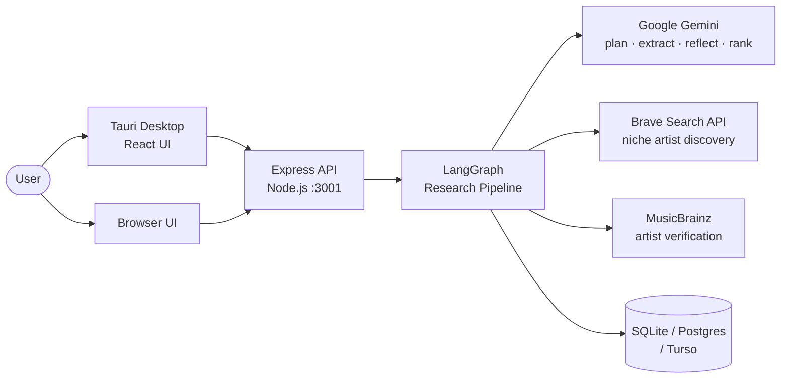
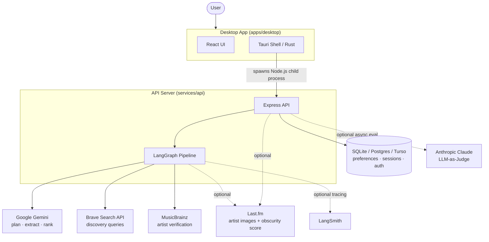
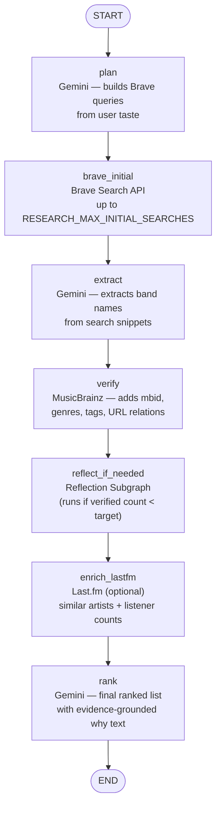
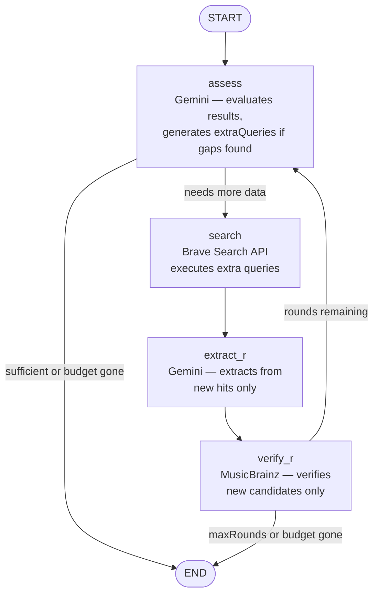
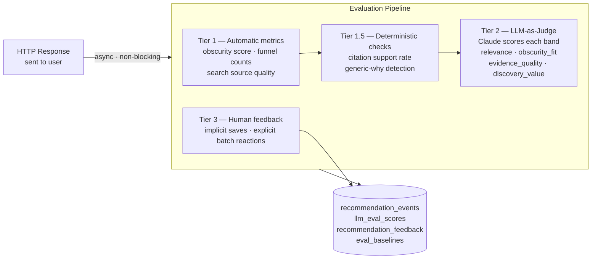

# Bandsearch Architecture

## Overview

Bandsearch is an AI-powered music recommendation system that discovers niche and lesser-known artists based on user taste. It is a monorepo containing a TypeScript/Express API backend, a Tauri+React desktop client, and shared validation contracts.

---

## System overview



---

## Monorepo structure

```
bandsearch-app/
├── apps/
│   └── desktop/         — Tauri + React desktop application (Rust + TypeScript)
├── services/
│   └── api/             — Express.js API server (TypeScript, Node.js 22+)
│   └── eval/            — Golden dataset and eval runner
├── shared/
│   └── schemas/         — Shared TypeScript validation contracts
├── docs/                — Architecture docs, ADRs, design specs, roadmap
├── scripts/             — Build and lint utilities
└── tests/               — End-to-end tests (Playwright)
```

---

## System topology

How the pieces connect at runtime. Solid arrows are always active; dashed lines require their corresponding API key.



---

## API Server (`services/api`)

The API is an Express.js application structured as follows:

| Module | Responsibility |
|--------|---------------|
| `server.ts` | Entry point — validates env, initializes pipeline, starts HTTP listener |
| `app.ts` | Express app factory — middleware (helmet, CORS, rate-limit, JSON logging) and route registration |
| `routes/registerBandsearchRoutes.ts` | Mounts all route handlers (auth, recommendations, preferences, sessions, artist search) |
| `recommendationPipeline.ts` | Lifecycle manager for the research graph — exposes `recommend()` and `whenReady()` |
| `agent/research/researchService.ts` | Thin wrapper around `invokeResearchGraph()` with error handling |

---

## LangGraph pipeline

The core recommendation logic is a LangGraph state machine defined in `agent/research/researchGraph.ts`.

### Graph state (`ResearchGraphState`)

| Field | Type | Description |
|-------|------|-------------|
| `userQuery` | `string` | Raw user input |
| `preferenceContext` | `string` | Formatted saved-band context |
| `messages` | `ChatMessage[]` | Conversation history |
| `mode` | `RecommendationMode` | `fresh` or `preference-aware` |
| `searchPlan` | `SearchPlan` | Planner output (anchor artists, style signals, queries) |
| `braveHits` | `SearchHitInput[]` | Raw web search results |
| `extractedCandidates` | `ExtractedCandidate[]` | Band names extracted from snippets |
| `verifiedCandidates` | `VerifiedCandidate[]` | MusicBrainz-verified candidates with metadata |
| `searchCallsUsed` | `number` | Brave API call counter |
| `reflectionUsed` | `boolean` | Whether reflection ran |
| `recommendations` | `unknown[]` | Final ranked output |
| `assistantReply` | `string` | Optional conversational prose |

### Main graph



| Node | Model / Service | Description |
|------|----------------|-------------|
| `plan` | Gemini | Generates targeted Brave search queries from user taste (FFO/Bandcamp-style) |
| `brave_initial` | Brave Search API | Executes up to `RESEARCH_MAX_INITIAL_SEARCHES` queries with dedup cache |
| `extract` | Gemini | Identifies band names from snippets; filters out anchor artists |
| `verify` | MusicBrainz | Looks up each candidate; adds `mbid`, genres, tags, URL relations |
| `reflect_if_needed` | Reflection Subgraph | Conditionally runs extra searches when verified count < target |
| `enrich_lastfm` | Last.fm (optional, skipped if `LASTFM_API_KEY` unset) | Adds listener counts and similar-artist evidence URLs to verified candidates |
| `rank` | Gemini | Produces final ranked list with evidence-grounded `why` text and optional prose reply |

### Reflection subgraph (`reflectionSubgraph.ts`)

Embedded as a compiled LangGraph subgraph within `reflect_if_needed`. Runs up to `maxRounds` (default 2) additional search-extract-verify cycles when the initial pass does not yield enough verified candidates.



| Node | Model / Service | Description |
|------|----------------|-------------|
| `assess` | Gemini | Evaluates current results; generates `extraQueries` when gaps are found |
| `search` | Brave Search API | Executes extra queries against remaining budget; stores new hits in `newHits` separately from the accumulated `braveHits` |
| `extract_r` | Gemini | Extracts candidates from `newHits` **only** (not all accumulated hits); merges into existing `extractedCandidates` via `mergeExtractedCandidates` |
| `verify_r` | MusicBrainz | Verifies only candidates not yet present in `verifiedCandidates` (by name/canonicalName); merges via `mergeVerifiedCandidates` — preserves all prior-round results |

### Budget management (`researchBudget.ts`)

A shared `ResearchBudget` instance tracks wall-clock time against `RESEARCH_TIMEOUT_MS` (default 45 s — generous because the Brave Free plan throttles to 1 request/second). Each node calls `budget.allocate(ms)` to claim a per-operation slice. When the budget is exhausted, conditional edges route directly to `END` rather than timing out mid-flight.

---

## External Integrations

| Integration | Used in | Purpose |
|-------------|---------|--------|
| **Brave Search API** | `brave_initial`, `search` | Web discovery for niche and underground artists |
| **Google Gemini** (`@langchain/google-genai`) | `plan`, `extract`, `assess`, `rank` | All structured reasoning and text generation |
| **MusicBrainz** | `verify`, `verify_r` | Artist metadata verification (mbid, genres, tags, URL relations) |
| **Wikidata + Last.fm** | `/artists/image` endpoint | Artist image resolution with Last.fm fallback |
| **Last.fm** (optional) | `enrich_lastfm` | Similar-artist evidence and listener-count obscurity scoring, skipped when `LASTFM_API_KEY` is unset |
| **Anthropic Claude** (optional) | Eval layer | Async LLM-as-Judge scoring — never on the critical path. Configured via the `MISTRAL_API_KEY` env var (legacy name; the key is sent to Claude, not Mistral) |
| **LangSmith** (optional) | Graph invocation | Distributed tracing for the LangGraph pipeline |

---

## Evaluation layer

An async, non-blocking quality-scoring system that runs after the HTTP response is sent. Full design in [2026-05-29-eval-architecture.md](2026-05-29-eval-architecture.md).



| Tier | Mechanism | When | Signals |
|-------|-----------|------|---------|
| **1 — Automatic metrics** | Runs immediately | After every request | Obscurity score (Last.fm listener count), funnel counts (hits / extracted / verified), search source quality |
| **1.5 — Deterministic checks** | Runs immediately | After every request | Citation support rate (evidence URLs per recommendation), generic-why detection |
| **2 — LLM-as-Judge** | Async, fire-and-forget | When `MISTRAL_API_KEY` is set | Anthropic Claude scores each band on `relevance`, `obscurity_fit`, `evidence_quality`, `discovery_value` |
| **3 — Human feedback** | Event-driven | User action | Implicit saves + explicit one-tap batch reactions |

Eval data is stored in `recommendation_events`, `llm_eval_scores`, `recommendation_feedback`, and `eval_baselines` tables.

---

## Storage

Two persistence domains, both backed by an abstract repository pattern to allow swapping backends without changing business logic.

### Preferences store (`PREFERENCE_STORE`)

| Backend | Config | Use case |
|---------|--------|----------|
| `sqlite` (default) | `DATABASE_PATH` | Local, zero-config |
| `memory` | — | Ephemeral / testing |
| `postgres` | `DATABASE_URL` | Shared or hosted deployment |
| `turso` | `TURSO_DATABASE_URL` + `TURSO_AUTH_TOKEN` | Cross-device cloud sync |

Tables: `saved_bands` (rating, categories, notes), `artist_groups`

### Session store

SQLite (`bandsearch.db`) with in-memory fallback. Tables: `chat_sessions`, `chat_messages`.

### Auth store

Same backend as preferences. Table: `users` (bcrypt-hashed passwords). JWTs with 30-day expiry; password recovery via single-use recovery codes.

---

## Authentication

Three-tier progressive auth — determined by the number of registered users at runtime:

| Users registered | Mode |
|-----------------|
| 0 | Pass-through — no auth checks |
| 1 | Auto-attach — all requests associated with the single user |
| ≥ 2 | Enforced — `Authorization: Bearer <token>` required for preference endpoints |

---

## Desktop client (`apps/desktop`)

- **Stack:** Tauri (Rust shell) + React (TypeScript)
- **API process:** spawned as a Node.js child process; production builds use a Tauri-bundled Node sidecar
- **Screens:** Welcome, Settings, Chat (responsive layout via `matchMedia`, breakpoint 767 px)
- **API key storage:** OS config directory (`~/.config/bandsearch/config.json` on Linux)

---

## Prompt guards

`agent/promptGuards.ts` wraps all user-controlled content before sending to models — escapes special characters, formats preference context blocks, and structures conversation history to prevent prompt injection. See [ADR 0001](../adr/0001-prompt-injection-guardrails.md) for the design rationale.

---

## Key design decisions

| Decision | Rationale |
|----------|----------|
| **Gemini for all graph nodes** | Consistent structured-JSON output across plan / extract / reflect / rank; low temperature (0.2) for planning reduces variance |
| **Claude as optional async judge** | Keeps the LLM judge off the critical response path; eval can be added/removed without touching the graph |
| **Budget-aware graph** | Hard wall-clock deadline enforced via `researchBudget.ts`; conditional edges bypass remaining nodes gracefully instead of timing out mid-flight |
| **Pluggable storage** | Abstract repository pattern allows SQLite → Postgres → Turso swap without touching business logic |
| **Progressive auth** | Single-user deployments require no configuration; auth activates as users are added |
| **Dedup cache for Brave** | `BraveDedupCache` (Map) prevents redundant API calls within a single recommendation request |
| **Reflection as nested subgraph** | LangGraph subgraph encapsulates the reflection loop's own state and conditional edges cleanly, keeping the main graph linear |
| **Symmetric merge helpers** | `mergeExtractedCandidates` and `mergeVerifiedCandidates` follow the same contract (flat array → deduped array); reused across reflection rounds and as a defensive layer inside `formatEvidenceForPrompt` |
| **Defensive ranker dedup** | `formatEvidenceForPrompt` deduplicates `verifiedCandidates` by `mbid › canonicalName › name` before building the LLM evidence block, regardless of upstream state |
